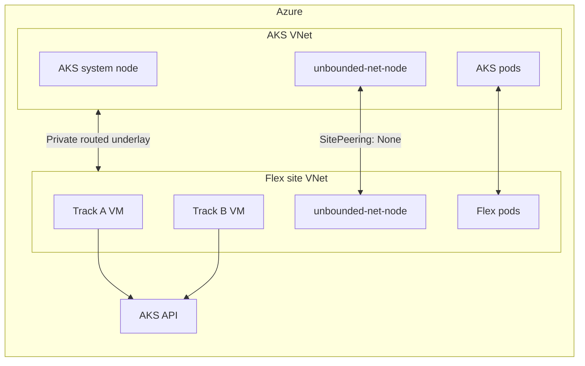

# Private-L3 Release Validation Test Plan

## Document Status

| Field | Value |
|---|---|
| Status | Draft - awaiting execution approval |
| Last updated | 2026-07-22 |
| Infrastructure state | Not created |
| Current step | Step 1 - read-only environment preflight |
| Unbounded release | `v0.1.24-rc.9` |
| AKS Flex Node release | `v0.1.5.alpha-4` |

This is the living plan and execution record for validating the newly released
Unbounded and AKS Flex Node artifacts in a topology representative of a
customer bare-metal site connected to Azure through VPN, ExpressRoute, or an
equivalent private routed network.

Update this document after every step. Record commands, redacted evidence,
decisions, and findings before proceeding. Do not rewrite earlier findings to
make later results look cleaner; append corrections and status changes.

## Execution Protocol

1. Execute exactly one numbered step at a time.
2. Stop at every `PAUSE GATE`.
3. Present the evidence and findings to the user.
4. Continue only after explicit approval for the next numbered step.
5. Do not delete or recreate resources unless the cleanup step is explicitly
   approved.
6. Never print bootstrap tokens, private keys, SAS query strings, service
   principal secrets, or complete node configs.
7. Stop immediately when an observed resource, route, image, version, or
   mutation differs from this plan. Record the difference as a finding before
   deciding how to proceed.

Status values used below:

- `NOT STARTED`
- `IN PROGRESS`
- `BLOCKED`
- `PASS`
- `PASS WITH FINDINGS`
- `FAIL`
- `SKIPPED`

## Objectives

### Objective 1: Release Artifact Validation

Validate that all newly produced artifacts from both releases are available,
internally consistent, and usable as intended.

Artifact validation has two levels:

- Supply-chain validation for every released artifact: availability,
  checksums, signatures, SBOMs, BOM references, image digests, and supported
  platforms.
- Runtime validation for components used by this scenario: Unbounded operator,
  Unbounded-Net, Gantry, AKS Flex Controller, and `aks-flex-node`.

Metalman, Orca, Unbounded Storage, GPU rootfs images, and standalone
`unbounded-agent` receive supply-chain validation only. Their functional tests
require dedicated infrastructure and are outside this test.

### Objective 2: Customer Private-Routed Topology

Validate the released software on a topology representative of:

```text
AKS VNet <-> VPN/ExpressRoute/private routing <-> bare-metal site
```

The Azure test substitutes bidirectional VNet peering for the customer private
link:

```text
AKS VNet <-> VNet peering <-> Flex site VNet
```

Unbounded uses direct private L3 connectivity:

```yaml
meshNodes: false
tunnelProtocol: None
```

No `GatewayPool`, `SiteGatewayPoolAssignment`, or public WireGuard gateway is
part of this topology.

### Objective 3: Bare-Metal Onboarding Experience

Validate two distinct onboarding implementations against the same cluster and
network:

- Track A: released `v0.1.5.alpha-4` `aks-flex-config prepare-node` payload.
- Track B: PR #248 storage-backed, baked-agent bootstrap candidate.

Track A validates what is released today. Track B validates the proposed
customer production model. Results must not be combined or described as if one
implementation validated the other.

## Scope Boundaries

### In Scope

- One small AKS cluster.
- One AKS system node.
- No built-in CNI at AKS creation.
- Unbounded-Net as CNI on AKS and Flex nodes.
- Private routed underlay represented by VNet peering.
- Unbounded Site Operator adoption of the bootstrapped network stack.
- Two clean Flex VM onboarding attempts.
- CNI, kube-proxy, pod routing, DNS, services, kubelet callbacks, and Gantry.
- Released artifact integrity and version consistency.
- Documentation and operational gap discovery.

### Out of Scope

- Production VPN or ExpressRoute provisioning.
- Physical BMC/PXE provisioning.
- Metalman functional validation.
- Unbounded Storage and RDMA validation.
- Orca functional validation.
- GPU validation.
- Scale, performance, HA, and upgrade soak testing.
- Declaring either prerelease generally available.

## Release Baseline

### Unbounded

| Field | Value |
|---|---|
| Version | `v0.1.24-rc.9` |
| Git commit | `0758e2f0a07b7833c8270479efb1e9b39a969eb6` |
| GitHub release state | Draft prerelease |
| Asset count | 38 |
| Asset access | Authenticated GitHub access required while draft |
| Release BOM | `unbounded-release-bom-v0.1.24-rc.9.json` |

Core runtime images:

| Component | Tag | BOM digest |
|---|---|---|
| Operator | `ghcr.io/azure/unbounded-operator:v0.1.24-rc.9` | `sha256:1c66cfa5c75b05a6cc597029c470bbb14c5a6f59a2e8947c8d658c9fe849cf6e` |
| Net controller | `ghcr.io/azure/unbounded-net-controller:v0.1.24-rc.9` | `sha256:16cf510f4cda5a9e84f91c8d94c486e4ae32354add482d35f04c7d9ca504b139` |
| Net node | `ghcr.io/azure/unbounded-net-node:v0.1.24-rc.9` | `sha256:e586953da71102cd194232739cf0a49148f619199b4fe54ea29e61b3d03c1fa8` |
| Gantry | `ghcr.io/azure/gantry:v0.1.24-rc.9` | `sha256:6fb3017d273508e0ca9fe9a5cf42f44312118bc383f8bea7bf1b45bc7645e4ca` |

### AKS Flex Node

| Field | Value |
|---|---|
| Version | `v0.1.5.alpha-4` |
| Git commit | `9d7e22c7633e1fc57a0551552409e6914ef5951e` |
| Repository | `vpatelsj/AKSFlexNode` |
| GitHub release state | Published prerelease |
| Asset count | 11 |
| Unbounded Go module | `v0.1.24-rc.9` |
| Release BOM | `aks-flex-node-release-bom-v0.1.5.alpha-4.json` |
| Controller image | `ghcr.io/vpatelsj/aks-flex-controller:v0.1.5.alpha-4` |
| Controller digest | `sha256:4091beaa9e6d7f6474dca4df82158a5195cf8f520fca23c6c9d7eedf4bb8e516` |

Track A runtime defaults:

| Artifact | Version/source |
|---|---|
| Kubernetes | Exact AKS control-plane patch version |
| Containerd | `2.0.4` |
| runc | `1.1.12` |
| Base CNI plugins | `1.5.1` |
| crictl | Kubernetes major/minor with patch `0` |
| Node Problem Detector | `v1.35.1` |
| Rootfs | `ghcr.io/azure/agent-ubuntu2404:v20260619` |
| Rootfs digest | `sha256:962aa78fd297b465ce3b134e3943e090a0ae79008e8caca809e372a1eaceb5f6` |
| Pause image | `mcr.microsoft.com/oss/v2/kubernetes/pause:3.9` |

## Target Topology



### Proposed CIDRs

These are provisional until Step 1 confirms they do not overlap connected
networks in the selected subscription.

| Purpose | CIDR |
|---|---|
| AKS VNet | `10.91.0.0/16` |
| AKS subnet | `10.91.1.0/24` |
| Flex VNet | `10.92.0.0/16` |
| Flex subnet | `10.92.1.0/24` |
| AKS pod CIDR | `10.93.0.0/16` |
| Service CIDR | `10.94.0.0/16` |
| DNS service IP | `10.94.0.10` |
| Flex pod CIDR | `10.95.0.0/16` |
| Track A private IP | `10.92.1.4` |
| Track B private IP | `10.92.1.5` |

## Key Architecture Decisions

| ID | Status | Decision | Reason |
|---|---|---|---|
| D-001 | ACCEPTED | Model the customer private link with peered VNets. | This preserves private routed node connectivity without provisioning production VPN/ExpressRoute. |
| D-002 | ACCEPTED | Create AKS with `--network-plugin none`. | This is the topology validated by the AKS Flex Node private-L3 labs. |
| D-003 | ACCEPTED | Use Unbounded-Net CNI on both Sites. | Both AKS and Flex nodes therefore use `manageCniPlugin: true`. |
| D-004 | ACCEPTED | Use `SitePeering` with `meshNodes: false` and `tunnelProtocol: None`. | The underlay already routes node traffic; no overlay gateway is required. |
| D-005 | ACCEPTED | Do not create GatewayPool resources. | Gateway routing can redirect Flex node CIDRs through `unbounded0` and interfere with kubelet callbacks. |
| D-006 | ACCEPTED | Do not use `site init` for final topology creation. | It creates gateway assignments and cannot express this exact private-L3 resource set without immediate corrective mutations. |
| D-007 | ACCEPTED | Run released and proposed onboarding on separate clean VMs. | This prevents one bootstrap implementation from contaminating the other. |
| D-008 | ACCEPTED | Use a private AKS API endpoint. | This matches the intended customer private-routed topology. The administration path must be established before AKS creation. |
| D-009 | ACCEPTED | Use short-lived SAS URLs for Track B Storage access. | SAS works on generic bare metal without depending on Azure VM managed identity. URLs and query strings must remain redacted. |
| D-010 | ACCEPTED | Use a private management VM reached through Azure Bastion and VS Code Remote SSH. | The agent executor and `kubectl` will run inside the routed VNet without exposing the AKS API or management VM publicly. |

## Known Bootstrap Gap

The released operator Deployment is not host-networked. A no-CNI AKS node
cannot start ordinary pods, so the operator cannot start and install the CNI
that would make the node Ready.

This plan tests the following explicit bootstrap transition:

1. Apply released CRDs directly.
2. Apply the final Site and SitePeering resources.
3. Apply released Unbounded-Net host-networked controller/node manifests.
4. Wait for the AKS node to become Ready.
5. Install the released operator.
6. Verify that the operator adopts and reconciles the same network resources
   without destructive drift or server-side apply conflicts.

This transition is an experiment, not a documented customer workflow. Treat
any required manual ownership correction as a release/product gap.

## Step Summary

| Step | Status | Description | Mutation |
|---|---|---|---|
| 0 | PASS | Review and approve this plan | None |
| 1 | IN PROGRESS | Final read-only environment preflight and decisions | None |
| 2 | NOT STARTED | Verify every released artifact | Local temporary files only |
| 3 | NOT STARTED | Create private network foundation | Azure network resources |
| 4 | NOT STARTED | Create no-CNI AKS | AKS resource |
| 5 | NOT STARTED | Bootstrap Unbounded-Net from release manifests | Kubernetes resources |
| 6 | NOT STARTED | Install operator and validate adoption | Kubernetes resources |
| 7 | NOT STARTED | Validate baseline private-L3 CNI | Test workloads |
| 8 | NOT STARTED | Create clean Track A VM | Azure VM resources |
| 9 | NOT STARTED | Prepare released Track A join payload | Kubernetes RBAC/token/controller/machine goal; local secret payload |
| 10 | NOT STARTED | Execute Track A join | Mutates Track A host |
| 11 | NOT STARTED | Validate Track A and private-L3 traffic | Test workloads |
| 12 | NOT STARTED | Configure and enable Gantry | Kubernetes resources and node containerd config |
| 13 | NOT STARTED | Validate Gantry distribution | Test workloads and image pulls |
| 14 | NOT STARTED | Prepare PR #248 candidate and Storage inputs | Candidate artifacts, Blob/identity resources |
| 15 | NOT STARTED | Create clean Track B VM | Azure VM resources |
| 16 | NOT STARTED | Execute PR #248 baked-agent bootstrap | Mutates Track B host |
| 17 | NOT STARTED | Compare onboarding paths | Test workloads only |
| 18 | NOT STARTED | Produce final gap report | Documentation only |
| 19 | NOT STARTED | Cleanup, only after explicit approval | Destructive |

## Detailed Execution Plan

### Step 0 - Plan Review

**Status:** `PASS`

Review objectives, topology, scope, release baselines, decision log, and pause
protocol.

Acceptance criteria:

- User approves this plan as the execution source of truth.
- D-008 and D-009 may remain open until Step 1, but no infrastructure is
  created before they are resolved.

**PAUSE GATE 0:** Present the plan path and unresolved decisions. Wait for
approval to run Step 1.

### Step 1 - Read-Only Environment Preflight

**Status:** `IN PROGRESS`

Collect without creating resources:

- Azure subscription, tenant, and signed-in principal.
- Selected region.
- Resource provider registration state.
- AKS version availability.
- `Standard_D4s_v5` or approved replacement availability and quota.
- Exact AKS node OS SKU/image behavior.
- Exact Ubuntu 24.04 VM image URN and version.
- Existing resource-name collisions.
- Existing/connected VNet and on-premises CIDR overlap.
- Current workstation public IP for temporary SSH restrictions.
- Public versus private AKS API decision.
- Track B Storage authentication decision.

Proposed names, subject to collision checks:

```text
AKS resource group:  rg-aksflex-lab
Flex resource group: rg-aksflex-node-lab
AKS cluster:         aksflex-lab
AKS VNet:            aksflex-aks-vnet
Flex VNet:           aksflex-site-vnet
Track A VM:          flexnode-a
Track B VM:          flexnode-b
```

Evidence to record:

| Item | Observed value |
|---|---|
| Subscription | Pending |
| Region | Pending |
| AKS version | Pending |
| AKS API mode | Pending |
| VM SKU | Pending |
| Ubuntu image version | Pending |
| CIDR validation | Pending |
| Track B auth | Pending |

Current workstation observations from the initial read-only preflight:

- The command runner is WSL2 at `172.31.144.224/20` behind a Windows/WSL NAT.
- Its default route is through `172.31.144.1`.
- No route to the proposed `10.91.0.0/16` AKS VNet is currently present.
- Windows has two configured VPN profiles, but both are currently disconnected.
- The WSL Tailscale client is in `NeedsLogin` state and advertises no routes.
- DNS is supplied by the WSL/Windows resolver at `10.255.255.254` with
  corporate search suffixes. This does not prove that a future AKS private DNS
  zone will resolve.

Therefore local `kubectl` cannot be assumed to reach the private AKS endpoint.
Step 1 must select and prove one of these administration paths before Step 4:

1. A point-to-site/site-to-site VPN route from the Windows/WSL machine into the
   AKS VNet, with private DNS resolution for the AKS private FQDN.
2. A small management VM inside the AKS or peered Flex VNet, with all
   `kubectl`, Unbounded CLI, and AKS Flex Node preparation commands executed
   there.

`az aks command invoke` may be used for diagnostics or emergency manifest
application, but it does not replace the full administration host required by
`aks-flex-config prepare-node` and the step-by-step evidence collection.

**PAUSE GATE 1:** Show all selected values and estimated resource shape. No
resources exist yet.

### Step 2 - Release Artifact Verification

**Status:** `NOT STARTED`

Create a temporary local verification directory. Download and verify:

Unbounded `v0.1.24-rc.9`:

- Linux amd64 `kubectl-unbounded` archive and SBOM.
- Checksums and signature bundle.
- Manifest archive and signature bundle.
- Standalone operator manifest and signature bundle.
- Release BOM and signature bundle.
- Every image reference/digest/platform in the release BOM.

AKS Flex Node `v0.1.5.alpha-4`:

- `aks-flex-config`.
- Linux amd64 agent archive and SBOM.
- Controller manifest and signature bundle.
- Release BOM and signature bundle.
- Checksums and signature bundle.
- Controller image digest/platforms.

Supply-chain-only verification:

- All remaining release asset filenames exist.
- All release images are anonymously resolvable by tag and BOM digest.
- Every image has the expected amd64/arm64 platforms.

No release binary is installed globally during this step.

**PAUSE GATE 2:** Present a pass/fail matrix for every artifact. Stop on any
missing, mismatched, unsigned, or inaccessible artifact.

### Step 3 - Private Network Foundation

**Status:** `NOT STARTED`

Create:

- Two resource groups.
- AKS VNet and subnet.
- Flex VNet and subnet.
- NSGs with least-privilege initial rules.
- Bidirectional VNet peering with VNet access and forwarded traffic enabled.

Do not create AKS or VMs in this step.

Validate:

- Peering status is Connected in both directions.
- Effective address spaces match the approved plan.
- No gateway transit is enabled unless specifically required.
- No default broad inbound SSH rule exists.

**PAUSE GATE 3:** Show resource IDs, address spaces, peerings, and NSG rules.

### Step 4 - Create No-CNI AKS

**Status:** `NOT STARTED`

Create one-node AKS with:

```text
network plugin: none
AKS pod CIDR: 10.93.0.0/16
service CIDR: 10.94.0.0/16
DNS service IP: 10.94.0.10
node count: 1
node size: approved Step 1 SKU
API mode: approved Step 1 public/private choice
```

Expected initial state:

- Kubernetes Node exists.
- Node remains NotReady with network plugin not initialized.
- Host-network control-plane components may run.
- Ordinary pods cannot run yet.

**PAUSE GATE 4:** Show the AKS network profile, node status, and expected CNI
error. Do not install networking until reviewed.

### Step 5 - Bootstrap Unbounded-Net

**Status:** `NOT STARTED`

From the verified release archive:

1. Apply Machina and network CRDs required by the promoted Site API.
2. Wait for CRDs to become Established.
3. Apply final resources directly:
   - `Site/cluster`, `manageCniPlugin: true`.
   - `Site/flex`, `manageCniPlugin: true`.
   - `SitePeering/cluster-flex-private-l3`.
   - `meshNodes: false`.
   - `tunnelProtocol: None`.
   - Gantry explicitly disabled initially.
   - Machina, Metalman, and Storage disabled.
4. Apply the released net ConfigMap, RBAC, controller, and node manifests.
5. Wait for the network controller and node DaemonSet.
6. Wait for the AKS node to become Ready.

Validate:

- Images match BOM digests.
- AKS node gets the `cluster` Site label.
- AKS node receives a pod CIDR from `10.93.0.0/16`.
- CNI config is written once and references expected plugin types.
- No GatewayPool resources exist.

**PAUSE GATE 5:** Show exact applied resources, images, Site state, CNI file,
pod CIDR, and node readiness.

### Step 6 - Install Operator and Validate Adoption

**Status:** `NOT STARTED`

Install the released operator after CNI is functional. Do not recreate Sites.

Validate:

- Operator starts using the BOM-pinned image.
- Operator sees both existing Sites.
- Operator reconciles net resources without deleting or replacing working CNI
  state unexpectedly.
- No server-side apply conflict requires manual force ownership.
- Net images and config remain release-consistent.
- Site conditions become healthy.
- Gantry remains disabled.
- Machina, Metalman, and Storage remain disabled.

If the operator cannot adopt the directly bootstrapped resources cleanly, stop
and record a release-critical finding.

**PAUSE GATE 6:** Present operator logs, ownership/adoption behavior, workload
diffs, Site conditions, and any reconciliation findings.

### Step 7 - Baseline Private-L3 CNI Validation

**Status:** `NOT STARTED`

Before adding Flex nodes:

- Run an AKS-node pod.
- Validate pod startup, DNS, service routing, and external egress.
- Verify routes to the future Flex node CIDR use the Azure VNet path.
- Confirm there is no route for Flex node addresses through `unbounded0`.
- Confirm no GatewayPool resources exist.

**PAUSE GATE 7:** Present baseline workload and route results.

### Step 8 - Create Track A VM

**Status:** `NOT STARTED`

Create a clean Ubuntu 24.04 VM using the exact image selected in Step 1.

Requirements:

- Static private IP `10.92.1.4`.
- SSH exposed only to the approved administration source.
- No bootstrap payload at VM creation.
- No preinstalled AKS Flex Node binary.

Read-only host validation after creation:

- SSH works.
- Hostname is `flexnode-a` or explicitly approved equivalent.
- systemd and systemd-nspawn support are available.
- Kernel and required modules are visible.
- AKS API is reachable.
- AKS node private IPs are reachable over peering.
- Required release and upstream artifact endpoints are reachable.

**PAUSE GATE 8:** Show VM image, size, IPs, NSG, routes, systemd/kernel facts,
and connectivity results. Do not join the node yet.

### Step 9 - Prepare Released Track A Payload

**Status:** `NOT STARTED`

Use the released helper, not the repository working copy:

```bash
aks-flex-config prepare-node \
  --resource-group <aks-rg> \
  --cluster-name <aks-name> \
  --node-name flexnode-a \
  --node-ip 10.92.1.4 \
  --aks-flex-node-version v0.1.5.alpha-4 \
  --release-repository vpatelsj/AKSFlexNode \
  --variant script \
  --output <protected-path>
```

Cluster mutations expected in this step:

- AKS Flex Node bootstrap RBAC.
- Short-lived bootstrap token Secret.
- Version-pinned Flex Controller and RBAC.
- `aks-flex-machines` ConfigMap entry for `flexnode-a`.

Local mutation:

- Root/user-only mode `0600` bootstrap payload.

Evidence must redact token and config contents. Record only token Secret name,
expiration, config hash, payload hash, controller image/digest, and machine goal
metadata.

**PAUSE GATE 9:** Review every cluster mutation and redacted payload summary.

### Step 10 - Execute Released Track A Join

**Status:** `NOT STARTED`

Run the generated payload on Track A as root.

Expected operations:

- Install required Ubuntu packages.
- Download `aks-flex-node-linux-amd64.tar.gz` from the fork release.
- Verify the release checksum.
- Install the binary.
- Pull the Ubuntu 24.04 nspawn rootfs.
- Download pinned Kubernetes/runtime artifacts.
- Atomically write config mode `0600`.
- Run preflight.
- Run `aks-flex-node start` with `umask 022`.

Stop on any preflight warning that was not already approved.

**PAUSE GATE 10:** Present redacted bootstrap output, downloaded versions, host
mutations, and service state. Do not run workloads yet.

### Step 11 - Validate Track A

**Status:** `NOT STARTED`

Host checks:

- `aks-flex-node-agent.service` active and enabled.
- `kube1` nspawn machine active.
- kubelet and containerd active inside `kube1`.
- Config mode/ownership correct.
- Applied component versions match the Flex BOM.

Cluster checks:

- Node `flexnode-a` exists and is Ready.
- Internal IP is `10.92.1.4`.
- Site is `flex`.
- Pod CIDR is from `10.95.0.0/16`.
- Unbounded-Net node and managed kube-proxy run on the Flex node.
- No GatewayPool exists.

Traffic checks in both directions:

- Pod IP ping or TCP request.
- ClusterIP service.
- DNS.
- External egress.
- `kubectl exec`.
- `kubectl logs`.
- `kubectl port-forward`.

Route check:

- AKS-to-Flex node IP uses Azure private routing, not `unbounded0`.

**PAUSE GATE 11:** Present each check as an individual pass/fail result.

### Step 12 - Configure and Enable Gantry

**Status:** `NOT STARTED`

Before enabling Gantry:

- Create a real `gantry-config` with explicitly selected registries.
- Remove the `registry.example.com` placeholder.
- Start with public registries only.
- Record whether optional NetworkPolicy hardening is deferred.

Enable Gantry through Site component configuration only after the config is
present.

Validate:

- Operator reconciles Gantry and node-config DaemonSets.
- Gantry image matches BOM digest.
- Busybox helper image matches the recorded digest.
- Containerd socket permissions are compatible.
- Agent-managed and Gantry-managed mirror markers coexist.
- Containerd mirror file is correct on AKS and Flex nodes.
- Resource requests fit the selected VM sizes.

**PAUSE GATE 12:** Show config with no credentials, workload state, image
digests, socket permissions, mirror files, and resource usage.

### Step 13 - Validate Gantry

**Status:** `NOT STARTED`

Use a unique image tag/digest not already cached on either node.

Validate:

- Workload pull succeeds on both nodes.
- `gantry_storage_mode_info{mode="containerd"} == 1`.
- DHT health reaches expected threshold.
- Origin pull occurs on selected puller nodes.
- Peer fetch count increases on the second node.
- Origin fallback remains near zero.
- Containerd continues verifying and storing image content.
- Removing/stopping Gantry has the documented fallback behavior.

**PAUSE GATE 13:** Present metrics and pull timings. Record whether Gantry adds
value at this two-node scale or only proves correctness.

### Step 14 - Prepare PR #248 Candidate

**Status:** `NOT STARTED`

PR #248 is not part of `v0.1.5.alpha-4`. Build and track it as a separate
candidate.

Preparation tasks:

- Rebase/cherry-pick PR #248 onto the `v0.1.24-rc.9` dependency baseline.
- Resolve conflicts with the released `bootstrap` alias and Track A changes.
- Run all repository quality gates and protected E2E if available.
- Produce an amd64 candidate binary and SHA-256.
- Do not describe the candidate as a released artifact.

Provision private Blob Storage:

- One private container for this test cluster.
- Partial start config stored as a credential-bearing object.
- Candidate agent archive stored under a versioned path.
- Short-lived read authorization.

Track B authentication must model non-Azure bare metal:

- Preferred: short-lived SAS URL for the first test.
- Alternative: service principal secret file with least privilege.
- Azure VM MSI may be tested separately, but is not accepted as proof for
  generic bare-metal authentication.

The control plane must separately prepare:

- Bootstrap RBAC/token or ARM bootstrap data.
- Machine goal/backend.
- Flex Controller if using in-cluster machine mode.
- Existing Sites and working CNI.

**PAUSE GATE 14:** Review candidate provenance, diff, tests, Blob layout,
redacted partial config schema, authorization model, and hashes.

### Step 15 - Create Track B VM

**Status:** `NOT STARTED`

Create a second clean Ubuntu 24.04 VM at `10.92.1.5`.

Model a baked host image by installing only the baseline PR #248 candidate
binary before first-boot invocation. Install host package prerequisites
separately because PR #248 intentionally does not own them.

Do not copy a complete node config to the host.

**PAUSE GATE 15:** Show clean-host state, baked candidate version/hash,
installed prerequisites, network path, and absence of final node config.

### Step 16 - Execute PR #248 Bootstrap

**Status:** `NOT STARTED`

Invoke the candidate with private Storage inputs:

```bash
aks-flex-node bootstrap \
  --start-config-url <redacted-private-url> \
  --agent-binary-url <redacted-private-url> \
  --agent-binary-sha256 <sha256> \
  --storage-auth <sas-or-service-principal>
```

Validate:

- Storage authentication does not leak secrets.
- Partial config retrieval succeeds.
- Agent archive digest is enforced.
- Atomic update and re-exec succeed.
- Hostname and node IP defaults resolve correctly.
- Final config is root-owned mode `0600`.
- Preflight passes.
- Node joins the existing `flex` Site.
- Private-L3 traffic and kubelet callbacks match Track A.
- Retry behavior is documented before and after host mutation.

**PAUSE GATE 16:** Present redacted bootstrap evidence and each validation
result independently.

### Step 17 - Compare Onboarding Paths

**Status:** `NOT STARTED`

Compare Track A and Track B:

| Dimension | Track A result | Track B result |
|---|---|---|
| Artifact provenance | Pending | Pending |
| Host image assumptions | Pending | Pending |
| Secret exposure | Pending | Pending |
| External dependencies | Pending | Pending |
| Control-plane preparation | Pending | Pending |
| Idempotency/retry | Pending | Pending |
| Node join success | Pending | Pending |
| Private-L3 behavior | Pending | Pending |
| Operational recovery | Pending | Pending |
| Customer usability | Pending | Pending |

**PAUSE GATE 17:** Agree which onboarding model is recommended and what must
change before customer use.

### Step 18 - Final Gap Report

**Status:** `NOT STARTED`

Summarize findings under:

- Release assets and supply chain.
- Documentation drift.
- No-CNI operator bootstrap.
- Site and routing behavior.
- AKS control-plane callbacks.
- Runtime version alignment.
- Gantry configuration and operations.
- Track A onboarding.
- PR #248 onboarding.
- Security and secret lifecycle.
- Cleanup and recovery.

Classify each finding:

- Release blocker.
- Customer blocker.
- Documentation blocker.
- Operational risk.
- Improvement.
- Observation.

**PAUSE GATE 18:** Review and approve the final report before cleanup.

### Step 19 - Cleanup

**Status:** `NOT STARTED`

Cleanup is destructive and requires separate explicit approval.

Order:

1. Delete test workloads.
2. Cordon and drain Flex nodes.
3. Uninstall/reset AKS Flex Node on each host.
4. Remove Kubernetes Node and machine-goal state.
5. Remove bootstrap token Secrets and local payloads.
6. Delete Track A and Track B VMs/NICs/public IPs.
7. Delete AKS.
8. Delete network resources and resource groups.
9. Delete temporary Blob container and credentials.
10. Verify no billable resources remain.

**PAUSE GATE 19:** Show the exact deletion list before executing cleanup, then
show post-cleanup resource queries.

## Step Execution Record

Append one row when each step changes state.

| Timestamp | Step | New status | Summary | Evidence |
|---|---|---|---|---|
| 2026-07-22 | 0 | IN PROGRESS | Initial living plan created. No Azure resources exist. | This document |
| 2026-07-22 | 0 | PASS | User approved the plan, private AKS API, short-lived SAS, and private management VM administration path. | Conversation approval |
| 2026-07-22 | 1 | IN PROGRESS | Started read-only environment preflight. No Azure resources exist. | Pending Step 1 evidence |

## Findings Log

Add findings as they are discovered. Do not reuse IDs.

| ID | Step | Severity | Classification | Status | Finding | Evidence | Follow-up |
|---|---|---|---|---|---|---|---|
| F-001 | Planning | High | Customer blocker | OPEN | The released Site Operator cannot bootstrap itself on a no-CNI AKS node because the operator pod is not host-networked. | Release manifests and code review | Validate direct-net bootstrap followed by operator adoption. |
| F-002 | Planning | Medium | Documentation blocker | OPEN | AKS Flex Node labs use direct Unbounded-Net `v0.1.10` manifests and legacy Site APIs rather than the `v0.1.24-rc.9` operator flow. | `docs/labs` review | Update docs after experiment establishes the working current flow. |
| F-003 | Planning | Medium | Operational risk | OPEN | Track A pins containerd `2.0.4` and runc `1.1.12`, while Unbounded `rc.9` defaults are containerd `2.1.8` and runc `1.5.0`. | Both release BOMs | Retain tested Track A pins; evaluate upgrades separately. |
| F-004 | Planning | Medium | Operational risk | OPEN | AKS Flex Node installs CNI plugins `1.5.1`, while the Unbounded-Net image bundles `1.9.1` and skips files that already exist. | Release BOM and net init script | Record effective plugin versions on both node types. |
| F-005 | Planning | Medium | Customer blocker | OPEN | PR #248 does not create cluster resources, install host packages, or install Site/CNI components. | PR #248 design non-goals | Define the control-plane preparation contract around the host bootstrap command. |
| F-006 | Planning | Medium | Security decision | OPEN | Azure VM MSI is convenient for PR #248 testing but may not represent generic non-Azure bare-metal Storage authentication. | PR #248 auth design | Prefer SAS or service-principal test for customer-like evidence. |
| F-007 | Planning | Medium | Test prerequisite | OPEN | This WSL workstation cannot currently route to or resolve a future private AKS endpoint. Both Windows VPN profiles are disconnected and Tailscale is not logged in. | Read-only Windows and WSL network preflight | Establish and prove a VPN/private DNS path or use an in-VNet management VM before creating AKS. |

## Decision Log

Append decisions and superseding decisions. Do not silently edit history.

| ID | Date | Decision | Rationale | Supersedes |
|---|---|---|---|---|
| DL-001 | 2026-07-22 | Use VNet peering to model customer VPN/ExpressRoute/private routing. | It preserves private L3 semantics with minimal Azure infrastructure. | - |
| DL-002 | 2026-07-22 | Use no-CNI AKS and Unbounded-Net on both Sites. | This matches the closest validated AKS Flex Node private-L3 lab. | Earlier Azure CNI Overlay proposal |
| DL-003 | 2026-07-22 | Validate released and PR #248 onboarding on separate VMs. | The two implementations have different trust, config transport, and recovery models. | - |
| DL-004 | 2026-07-22 | Use a private AKS API endpoint. | This matches the customer's private-routed control-plane model. | Earlier open API-mode decision |
| DL-005 | 2026-07-22 | Use short-lived SAS URLs for PR #248 Storage retrieval. | This is usable from non-Azure bare metal and avoids treating Azure VM MSI as customer-equivalent evidence. | Earlier open Storage-auth decision |
| DL-006 | 2026-07-22 | Run the agent executor and `kubectl` on a private management VM reached through Azure Bastion and VS Code Remote SSH. | This keeps the AKS API and management VM private while preserving an interactive LLM-assisted workflow. | Earlier open administration-path decision |

## Overall Acceptance Criteria

The test program passes only when:

1. Every release artifact receives a recorded supply-chain result.
2. All in-scope runtime images match their BOM digests.
3. The AKS node and both Flex nodes become Ready with expected pod CIDRs.
4. No GatewayPool resources exist.
5. Node and pod traffic use the intended private-routed underlay.
6. DNS, ClusterIP, exec, logs, and port-forward work on Flex workloads.
7. The operator adopts the bootstrapped CNI without destructive drift.
8. Gantry works without breaking ordinary containerd pulls.
9. Track A succeeds using only released artifacts.
10. Track B succeeds using a clearly identified candidate build and private
    Storage inputs.
11. All credentials and secret-bearing payloads are removed or accounted for.
12. Every failure and workaround is recorded in the findings log.

Passing this test does not convert either prerelease into a generally available
product. It establishes evidence for the tested versions, topology, and
onboarding paths only.